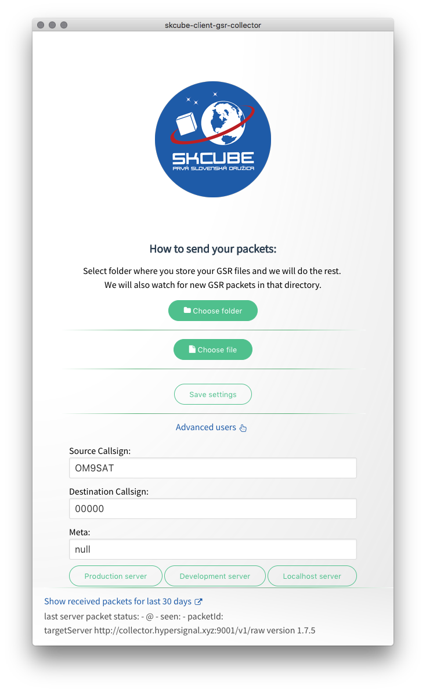
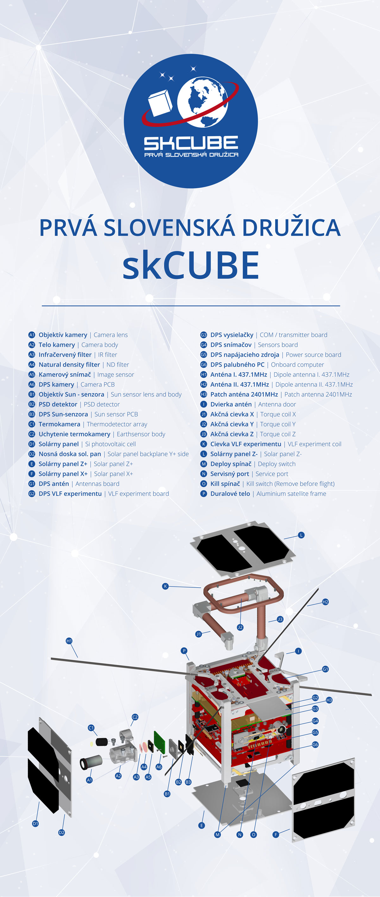

# skCube-data-collector
data from 🛰 🌌 space

[Travis-ci](https://travis-ci.org/yangwao/skCube-data-collector)
[Appveyor](https://ci.appveyor.com/project/yangwao/skcube-data-collector)

### Authors
* [Matej Nemček](https://github.com/yangwao)
* [Ivana Zemanovičová](https://github.com/Ivkaa)

### desktop-client

### Built app images
[Downloads for Linux, Mac OSX and Windows could be found in releases](https://github.com/yangwao/skCube-data-collector/releases) 

### Api
[Writing your own client? Server api documentation](server/README.md)

### Roadmap
- [x] send .gsr from client (wao)
- [x] store .gsr on server w/ callsign, timestamp, tag (wao)
- [x] parse .gsr (hex->dec) at server (ewe)
- store parsed .gsr to the db
- data explorer for parsed data fetched from db (~ [OpenMCT](https://nasa.github.io/openmct/))

### skCube
* [skCube homepage](http://www.skcube.sk/)
* [More about skCube](https://sk.wikipedia.org/wiki/SkCUBE)
* [Technologies on board SK](http://www.skcube.sk/skcube/technologie/)
* [Technologies on board EN](http://www.skcube.sk/skcube/first-slovak-satellite-skcube/)
* [For radioamateurs SK](http://www.skcube.sk/vystupy/pre-radioamaterov/)

### Other skcube.sk apps
* [3d.skcube.sk](https://3d.skcube.sk/)
* [data.skcube.sk](https://data.skcube.sk/)
* [gsr-parser](https://www.npmjs.com/package/gsr-parser)

### Other LEO/Cubesat projects
* [SatNogs](https://satnogs.org/)

## skCube teardown

